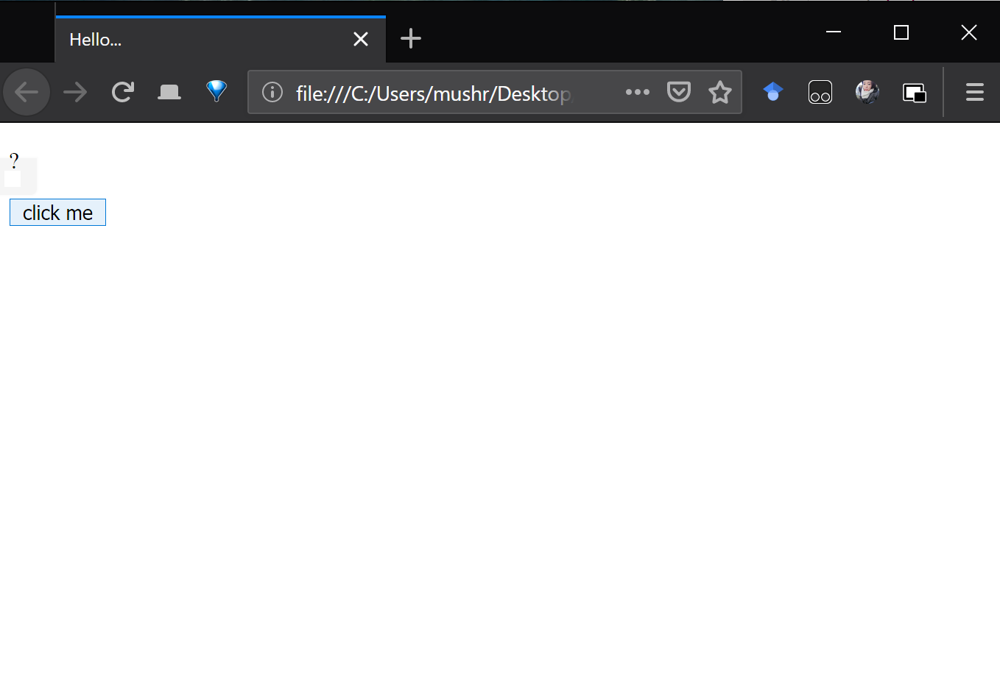
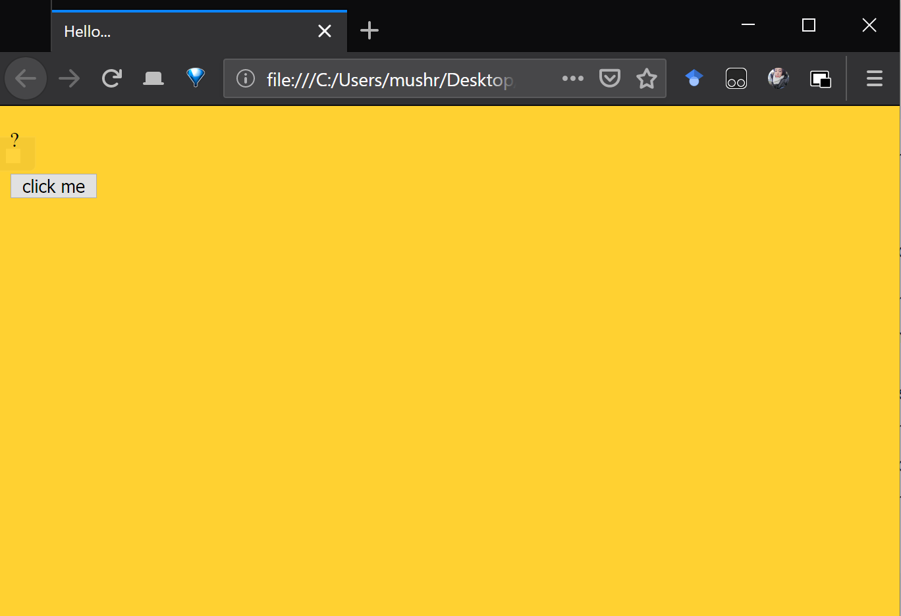
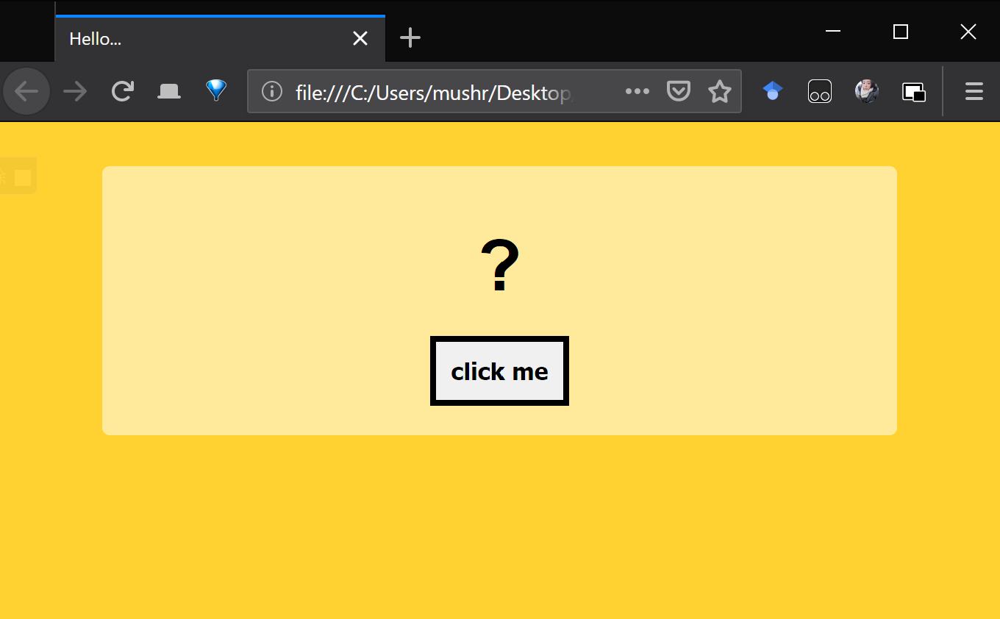
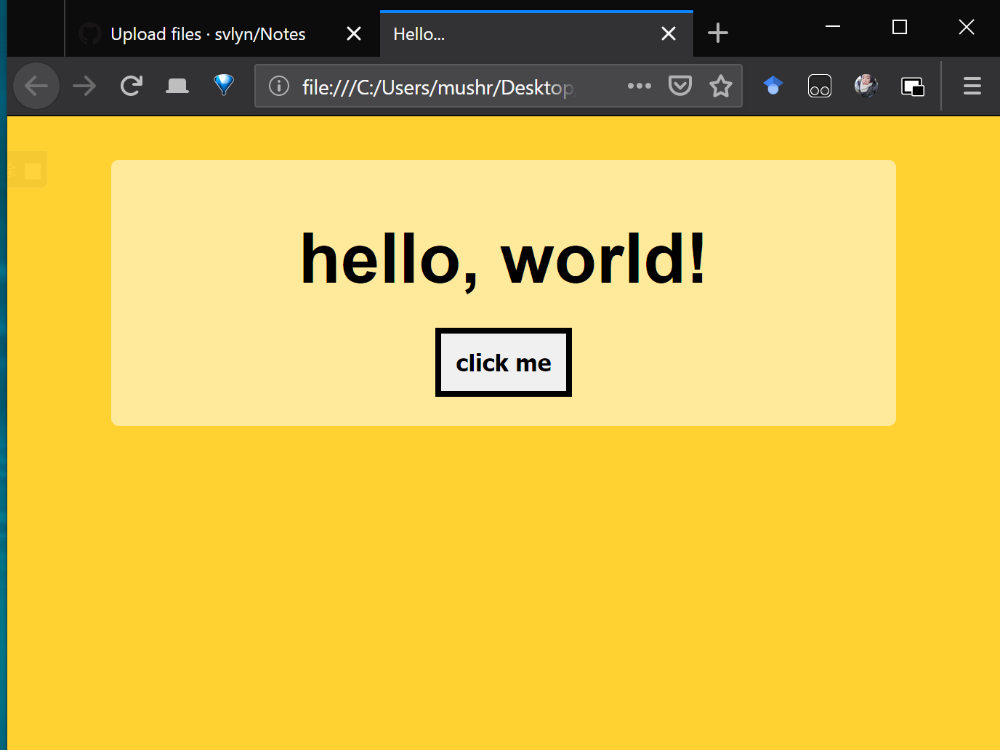

<!-- TOC depthFrom:1 depthTo:6 withLinks:1 updateOnSave:1 orderedList:0 -->

[1. **HTML STRUCTURE**](#1-html-structure)  

-   [1.1 HTML GENREAL FORMAT](#11-html-genreal-format)
-   [1.2 USAGE of CSS -- Adding the Visual Elements](#12-usage-of-css-adding-the-visual-elements)

    [1.2.1 Modify the Background Colours](#121-modify-the-background-colours)

    [1.2.2 Modify the rest of the elements.](#122-modify-the-rest-of-the-elements)

-   [1.3 JavaScript -- Adding Interactivity](#13-javascript-adding-interactivity)

<!-- /TOC -->

## 1. HTML STRUCTURE

### 1.1 HTML GENREAL FORMAT

All HTML documents must start with a document type declaration **a.k.a. doctype declaration**: `<!DOCTYPE html>`.  
The HTML document itself begins with `<html>` and ends with `</html>`.

**Eg.: A common HTML structure**

>     <!DOCTYPE html>
>     <html>
>        <head>
>            <title>test document</title>
>        </head>
>        <body>
>            

>                
?

>                <button>click me</button>
>              

>        </body>
>     </html>
>
> get:
>
> > 

### **1.2 USAGE of CSS -- Adding the Visual Elements**

To adjust the look of our HTML elements, we have to go beyond HTML.
We have to rely on the very complementary technology known as **Cascading Style Sheets (CSS)** that is all about styling and visual changes.        

### 1.2.1 Modify the Background Colours

There are serval ways to add CSS to web content, one of them is by adding a ``.
Inside this element, we can modify the website style by:

-   identifying the elements
-   specifying the visual property and the value that we want to set for the property.

>     <!DOCTYPE html>
>      <html>
>      <head>
>         <title>test document</title>
>                
>       </head>
>            <body>
>                

>                    
?

>                    <button>click me</button>
>                  

>            </body>
>         </html>
>
> get:
>
> > 

What we've added is known as a **Style Rule**. It is made up of Two parts.

-   The firstone is known as the **selector**, which we targeted the`body`element.
-   The Second part is known as the **declaration block**, which is everything inside the curly brackets that specifies what visual properties to modify.
-   On the element which targeted in the selector. In our case we are setting a property called `background-color` and giving it a yellow-is color by **value**`#FFD131`.

### 1.2.2 Modify the rest of the elements.

>        <!DOCTYPE html>
>        <html>
>        <head>
>          <meta charset="utf-8">
>          <title>Hello...</title>
>          
>        </head>
>        <body>
>          

>            
?

>            <button>click me</button>
>          

>        </html>
>
> get:
>
> > 

### 1.3 JavaScript -- Adding Interactivity

The first step to adding JavaScript to HTML webpage is to add the`script`element in `<body></body>`

    <!DOCTYPE html>
    <html>

    <head>
      <meta charset="utf-8">
      <title>Hello...</title>

      
    </head>

    <body>
      

        
?

        <button id="clickButton" class="button">click me</button>
      

      
      </body>
      </html>

  > get:
 >>  
