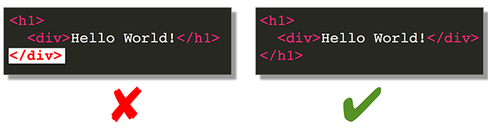

# 2. **HTML ELEMENTS**

-------

## 2.1. HTML TAG

-   Browsers do not display the HTML tags, But Tags labled content for page structure such as "heading", "paragraph", "table", etc.
    
-   Tags normally come in pair, they have the same name, but the end tag always starts with an extra "/".


-   Tags should be closed properly, before you start work on next tag, you have to close the current one. (There is some exceptions, see [Open Tags](<>).)



-------

HTML elements is everything from the **start tag** to the **end tag**. They used for group and labelling the context, define and render the content to text.
>
>  Format: **`<starttag>`**`content`**`</endtag>`**
>
> > eg:
> >
> > ```HTML
> > <body>......</body>
> > <p>......</p>
> > <div>......</div>
> > <b>......</b>
> > ```

Tags normally come in pair, they have same name, but the end tag always start with a extra "/".

> Format: **`<tagname attribute>`**`content`**`</tagname>`**
> Open Tag Format: **`<tagename....../>`**
>
> > eg:
> >
> > ```HTML
> > <br />
> > 
> > <input type="..." />
> > ```

-------

### 2.1.1. HTML ROOT TAGS


``` HTML
<!DOCTYPE HTML>
<html lang=“en”>
    <head>
    </head>
    <body>
        Body Content
    </body>
</html>
```

-------

### 2.1.2. The`<!DOCTYPE >`part
* doctype declaration refers to the rules for the markup language, so that the browsers render the content correctly. 

* The <!DOCTYPE> tag is an open tag, it does not have an end tag. 

* The <!DOCTYPE> declaration is **NOT**case sensitive.

-------

### 2.1.3. The `<head>` part

The `<head>`element contains information about an HTML document that is **used by browsers and web crawlers** but is **not displayed** to website visitors.

Semantic Information:

*  `<title>`defines the document’s title that is shown in a browser’s title bar or a page’s tab. 
   * It **only contains text**.
   * tags within the element are ignored.
   * There can be **ONLY ONE**` <title>` element in a document.

> ```HTML
> <!DOCTYPE HTML>
> <html lang=“en”>
>        <head>
>            <title>HTML Elements</title>
>        </head>
>        <body>
>       </body>
> </html>
> ```
       
* `<base>`, specifies the base URL to use for all relative  contained within a document. **There can be only one <base> element in a document.**
    The base URL of a document can be queried from a script using *`document.baseURI.`*
    * Eg.: if the image is `` Then we could set the `<base>`tag in `<head>`.

> ```HTML
> <head> 
>     <base href=“http://www.w3school.com.cn/i/“ />
> </head>
> <body>
>     
> </body>
> ```
        
* `<meta>`, help to define the webpage. Eg: define keywords, author, released date. Add a description or a redirect link to the page.

> ```HTML
> <head>
>     <meta name=”viewport“ content=”width=device-width, initial-scale=1.0“>
>     <meta name=”description“ content=”The HTML meta tag is an element that resides within the HTML head tag.“>
>     <meta name=”keywords“ content=”html, meta, tag, element“>
> </head>
> ```

* `<style>`contains style information for a document, or part of a document.

> ```HTML
> <!doctype html>
> <html>
>     <head>
>         <style>
>             p {
>                 color: red;
>            }
>         </style> 
>     </head>
>     <body>
>         <p>This is my paragraph.</p>
>     </body>
> </html>
> ```

* `<link>`, specifies relationships between the current document and an external resource.
> eg.：A link to external stylesheet:
> ```HTML
> <link href="main.css" rel="stylesheet">`
> ```
> 
> eg.: A link to the site’s favicon:
> ```HTML
> <link rel="icon" href="favicon.ico">
> ```
>
> eg.: Links for different stylesheets to choose.
> ```HTML
> <link href=“default.css” rel=“stylesheet” title=“Default Style”>
> <link href=“fancy.css” rel=“alternate stylesheet” title=“Fancy”>
> <link href=“basic.css” rel=“alternate stylesheet” title=“Basic”>
> ```

* `<script>`this is typically used to embed or refer to JavaScript code [^1] .

> ```HTML
> <!— HTML4 —>
> <script type=“text/javascript” src=“javascript.js”></script>

> <!— HTML5 —>
> <script src=“javascript.js”></script>
> ```

[^1]: It was once very common to place all JS into the <head>, however that is no longer recommended practice because it can slow down page load. Today, the typical recommendation is to place JavaScript at the end of the <body> element whenever possible.

* Relevant rel= links`, especially canonical URLs, links to RSS Feeds, and links to translations.

-------

### 2.1.4 The `<body>` Part

1. The `<body>`element represents the **content** of an HTML document. _There can be **ONLY ONE** <body> element in a document._

2. It must be the SECOND element of an `<html>` element. It must come after <head> element, ~~ (if <head> is present, which it doesn’t have to be)~~, there can be only one section in the document,which is `<body>`.

3. The `<body>` element exposes the `HTMLBodyElement` interface. You can access the <body> element through the `document.body` property.

-------

New `<body>` Elements in HTML5:

*  `<header>` is used to contain the content that appears at the top of every page of your website.
>     eg：the logo, tagline, search prompt,  a navigational menu,etc.
>     
> ```HTML
> <!DOCTYPE HTML>
> <html lang=“en”>
>        <head>
>        </head>
>        <body>
>            <header>
>            <body>
>                
>                <h1>HTML Élément</h1>
>                <p>about tags and attributions</p>
>           </header>
>       </body>
> </html>
> ```
       
* `<nav>` Navigational menus, commonly placed at the top of a web page, in a sidebar, or in the page footer. 

> ```html
> <a href=“/html5/index.asp”>Home</a> <a href=“/html5/html5_meter.asp”>Previous</a> <a href=“/html5/html5_noscript.asp”>Next</a>
> ```

* `<main>` Use the main element between header and footer elements to contain the primary content of your web page.
    * **_Should be direct descendant of the `body` element_**
    * OK to have more than one `main` element in a webpage.

> ```html
> <body>
> <main role=“main”>
>   <h1>TechOnTheNet.com</h1>
>   <p>Your trusted resource for learning new technologies.</p>
>   <article>
>     <h2>HTML</h2>
>     <p>Learn HTML (HyperText Markup Language) with our step-by-step tutorials and references.</p>
>   </article>
>   <article>
>     <h2>CSS</h2>
>     <p>Learn CSS (Cascading Style Sheets) with our step-by-step tutorials and references.</p>
>   </article>
> </main>
> </body>
> ```


* `<article>` informations that appeared on another website as syndicated content.
    * **_Shouldn’t place this element in `address`element._**

> ```HTML
> <body>
> <article>
>   <h1>Heading for Article</h1>
>   <p>Text that appears under article</p>
> </article>
> </body>
> ```

* `<aside>` wrapped up informations that isn’t directly related to the main content of the page. Commonly used for: advertisement, glossary definition, biography of the author, profile information, or related links.

> ```HTML
> <body>
> <aside>
>   <p>Text that appears under aside</p>
> </aside>
> </body>
> ```

* `<section>` is used to identify content that is a major sub-section of a larger whole. If a part of the content deserves its own heading, and that heading would be listed in a theoretical or actual table of contents, it should be placed in a `<section>`.
    * It can be used within articles, in the header or footer, or to define navigation.

> ```HTML
> <section> 
>     <h1>Pink Flamingos</h1> 
>     <p>Plastic flamingos have been used as garden ornaments since the late 1950s.</p> 
> </section>
> ```

*  `<address>` provides contact information for the nearest parent `article` or `body` element that contains it. 

> ```HTML 
> <address> You can contact us directly at 
>     <a mailto=“contact@html.com”>contact@html.com</a>. 
> </address>
> ```

* ` <footer>`is located in the bottom of the document. 
    * Also can be used [^2] within a main, section or article element.
    *  Commonly used for: copyright notice, links to related content, address information about the website, privacy policies and website’s terms of service, etc.

[^2]: instant of at the very top of the document, the `<header>` tag can also placed in different tags. 
